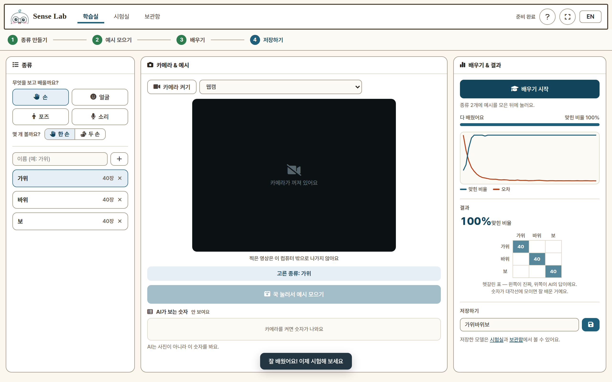
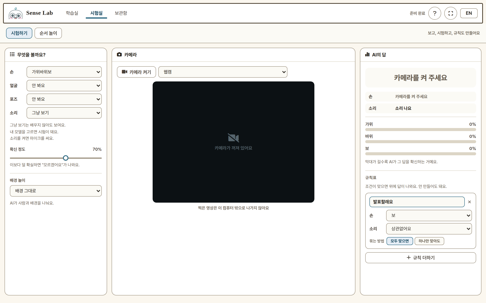
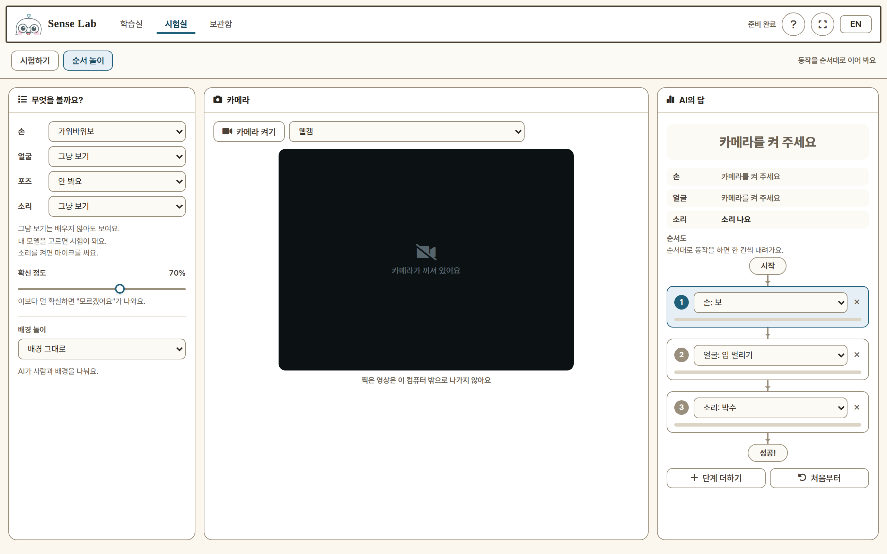
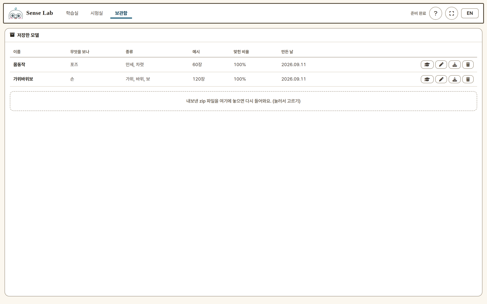

# Sense Lab

**브라우저에서 바로, 나의 몸짓과 소리를 AI에게 가르쳐요.**

Sense Lab은 어린이를 위한 수업용 웹앱입니다. 웹캠에 손 모양·표정·몸 동작을
보여 주거나 마이크에 소리를 내어 예시를 모으면, 약 1초 만에 작은 AI가
학습됩니다. 배운 모델을 시험하고, 규칙으로 엮고, 순서 놀이로 게임도 만들 수
있습니다.

설치도 가입도 없습니다. 모든 것이 브라우저 안에서 돌아가고, **찍은 영상과
들리는 소리는 컴퓨터 밖으로 나가지 않습니다.**

> 헤더의 **EN** 버튼을 누르면 화면 전체가 영어로 바뀝니다.
> 화면별 사용법은 **[사용 설명서](docs/MANUAL.md)** 에 그림으로 정리해 두었어요.

## 학습실 — 나만의 AI 모델 만들기

1. 무엇을 보고 배울지 고릅니다: **손, 얼굴, 포즈 — 그리고 소리**
   (소리는 마이크를 써요: 박수, 휘파람, 말소리를 가르칠 수 있어요).
   손과 포즈는 하나 더 고릅니다: **한 손 / 두 손**, **상반신 / 전신** —
   두 손을 쓰는 동작이나 춤이면 넓은 쪽을 고르세요.
2. 맞히고 싶은 **종류**를 만듭니다 (예: 가위 / 바위 / 보).
3. 카메라를 켜고 종류를 고른 뒤, **버튼을 꾹 눌러** 예시를 모읍니다.
   종류당 20~40장이면 충분합니다.
4. **배우기 시작**을 누르면 약 1초 만에 끝나요. 진행 그래프와 맞힌 비율,
   그리고 **헷갈린 표**가 나옵니다 — 어떤 종류끼리 헷갈렸는지 보고 예시를
   다시 모을 수 있어요.
5. 모델에 이름을 붙여 저장합니다.

카메라가 켜져 있는 동안 **"AI가 보는 숫자"** 패널에 좌표가 실시간으로
나옵니다 — AI가 사진이 아니라 숫자로 배운다는 걸 눈으로 확인할 수 있어요.

## 시험실 — 보고, 시험하고, 규칙 만들기

소스마다 하나를 고릅니다:

- **그냥 보기** — 학습 없이 바로 보여요. 손가락 개수, 얼굴 거리와 방향,
  입 벌리기/웃기, 손 들기, 박수·휘파람 같은 소리를 AI가 이미 알고
  있어요. 첫 체험용으로 좋습니다.
- **내 모델** — 학습실에서 가르친 모델을 시험해요. 종류별 확률이 막대로
  나오고, **확신 정도** 슬라이더보다 덜 확실하면 *"모르겠어요"* 라고
  답합니다.

원하면 **규칙표**를 만들 수 있어요: *"손 = 보 그리고 얼굴 = 가까이 →
내가 정한 답"*. 배운 종류와 그냥 되는 것을 섞어서, 모두 맞으면/하나만
맞아도 로 엮습니다.

**배경 놀이**도 있어요 — AI가 사람과 배경을 픽셀 단위로 나눠서 배경을
지우거나 흐리거나 초록 배경으로 바꿉니다.

## 순서 놀이 — 동작을 순서대로

순서도를 만듭니다: *보 → 입 벌리기 → 박수*. 각 단계를 잠깐 유지하면 한
칸씩 내려가고, 끝까지 가면 **성공!** — 동작과 소리로 만든 나만의 비밀
암호가 됩니다. 단계에는 배운 종류와 그냥 되는 것을 모두 쓸 수 있어요.

## 보관함 — 만든 것 지키기

저장한 모델이 모두 여기 있습니다. 이름을 바꾸고, **이어서 배우기**로
예시를 더 모아 다시 학습하고, **내보내기**로 zip 파일 하나로 받을 수
있어요. 다른 컴퓨터에서 zip 을 놓으면 그대로 복원됩니다 — 재부팅하면
초기화되는 교실 PC에서 유용합니다.

## 알아 두면 좋아요

- PC·태블릿·폰의 크롬/엣지에서 동작합니다. 카메라 권한을 허용해 주세요.
- 모델은 그 컴퓨터의 브라우저에 저장됩니다. 오래 보관하거나 옮길 때는
  **내보내기**를 쓰세요.
- 페이지에 처음 들어가면 캐릭터가 짧은 튜토리얼로 안내해요 — **?** 버튼으로
  언제든 다시 볼 수 있습니다.
- 태블릿·폰에서는 전체화면 버튼을 쓰거나, "홈 화면에 추가"하면 앱처럼
  전체화면으로 열립니다.

---

# Sense Lab (English)

**Teach an AI to see and hear you — right in the browser.**

Sense Lab is a classroom web app for kids. Show the webcam a hand sign, a
face, or a body pose — or clap and whistle into the mic — collect a few
examples, and train a small AI in about one second. Then test it, build
rules with it, and play a step-by-step signal game.

There is nothing to install and no sign-up. Everything runs inside the
browser — **the camera video and mic audio never leave your computer.**

> The screenshots below show the Korean UI. Press the **EN** button in the
> header to switch the whole app to English.
> A picture-first walkthrough lives in the [manual](docs/MANUAL.md) (Korean).

## Teach — make your own AI model

1. Choose what the AI should watch: **hand, face, body — or sound**
   (sound uses the microphone: teach it claps, whistles, or spoken words).
   Hand and body ask one more thing: **one hand / two hands**, and
   **upper body / whole body** — pick the wider one for two-handed moves
   or dancing.
2. Make "kinds" — the things you want it to tell apart
   (e.g. rock / paper / scissors).
3. Turn on the camera, pick a kind, and **hold the button** to collect
   examples. 20–40 per kind works well.
4. Press **Start teaching**. Training takes about a second and shows a
   progress chart, your score, and a **mix-up table** — so you can see
   which kinds got confused and collect better examples.
5. Give your model a name and save it.

While the camera is on, the **"Numbers the AI sees"** panel shows the live
coordinates — kids can see that the AI learns from numbers, not photos.

## Test — watch, test, and make rules

For each source, pick one of:

- **Just watch** — no training needed. The AI already knows finger counts,
  face distance and direction, mouth open / smiling, hands up, and sounds
  like claps and whistles. Great as a first hands-on demo.
- **My model** — test what you taught. All class probabilities show as
  bars, and the **"How sure"** slider decides when the AI says
  *"Not sure"* instead of guessing.

Optionally add **rules**: *"IF hand = paper AND face = near → my answer"*.
Rules can mix trained kinds with built-in signals, joined by ALL / ANY.

There is also **background fun** — the AI cuts you out of the background
(erase, blur, green screen), showing pixel-level AI at work.

## Step Game — signals in order

Build a flow chart of signals: *paper → mouth open → clap*. Hold each one
for a moment to pass a step and reach **Success!** — a secret password made
of moves and sounds. Steps can use trained kinds and built-in signals alike.

## Models — keep your work

Every saved model lives here: rename it, **continue teaching** (your
examples are saved with the model), or **export** it as a single zip file.
Drop the zip back in on any computer to restore it — handy for classroom
PCs that reset on reboot.

## Good to know

- Works in Chrome or Edge on PCs, tablets, and phones. Allow the camera
  when asked.
- Models are stored in the browser of that computer. Use **Export** to
  keep them safe or move them.
- First time on a page, a short character tutorial walks you through it —
  replay it anytime with the **?** button.
- On tablets and phones, use the fullscreen button, or "Add to Home
  Screen" for an app-like fullscreen experience.

---

*For developers — setup, structure, self-hosting: see [DEVELOP.md](./DEVELOP.md)
(개발·배포 안내는 [DEVELOP.md](./DEVELOP.md))*
