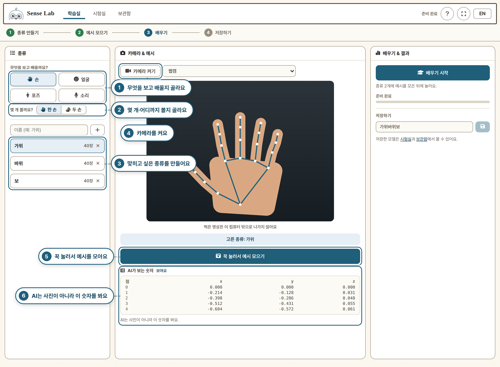
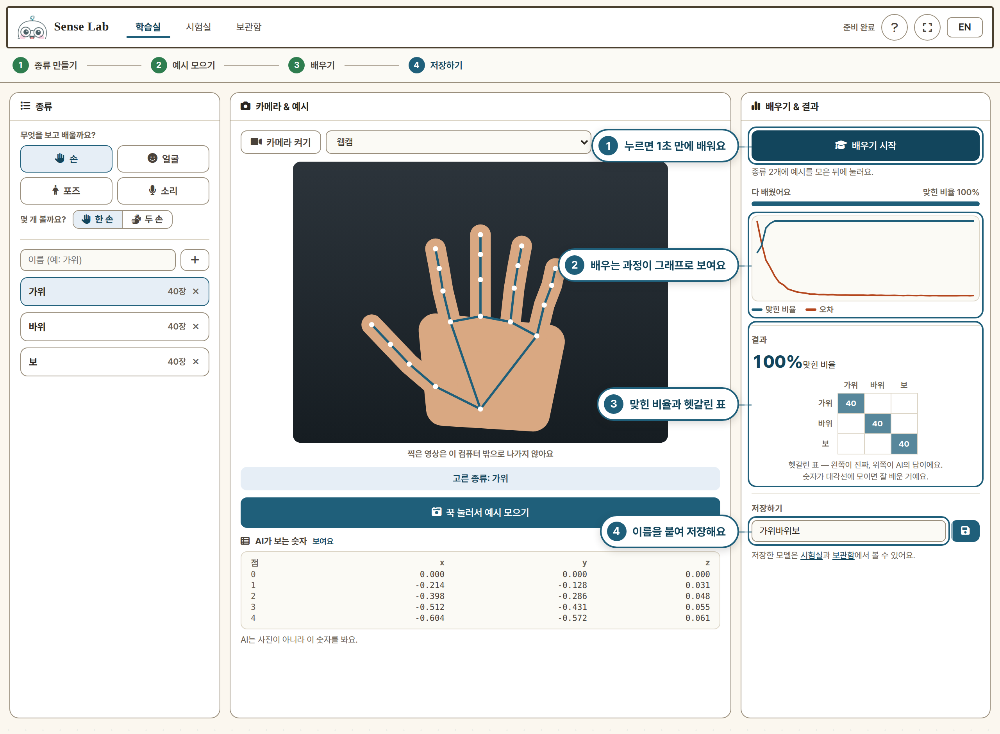
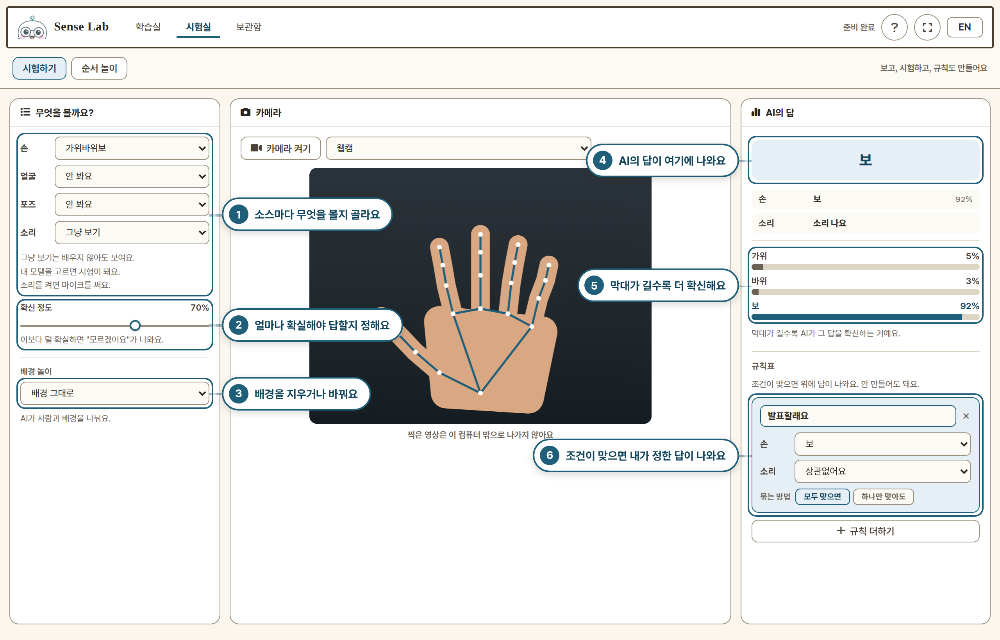
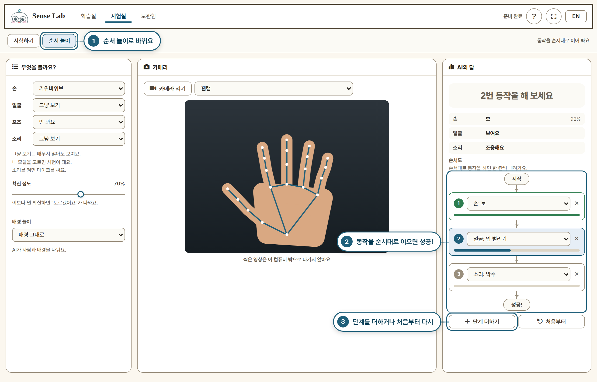
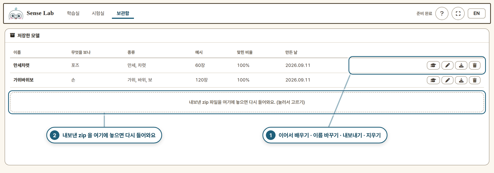

# Sense Lab 사용 설명서

그림 속 번호만 따라가면 돼요.
카메라 자리는 예시 그림이고, 숫자와 결과도 예시예요.

## 1. 종류 만들고 예시 모으기

## 2. 배우고 저장하기

## 3. 시험하기

## 4. 순서 놀이

## 5. 보관함

---

무엇을 할 수 있는지 전체 소개는 [README](../README.md) 를 보세요.
